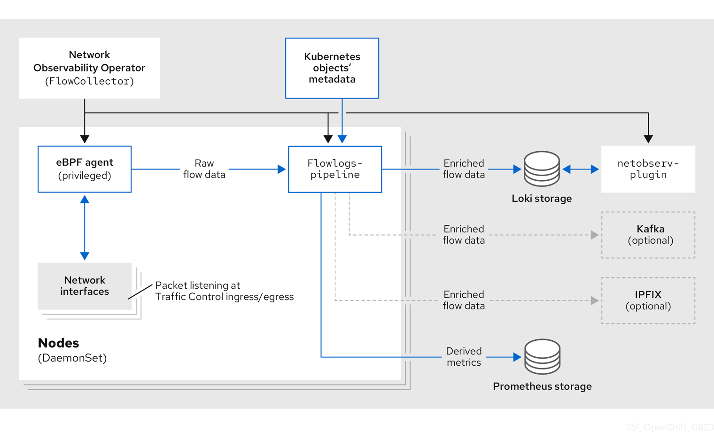
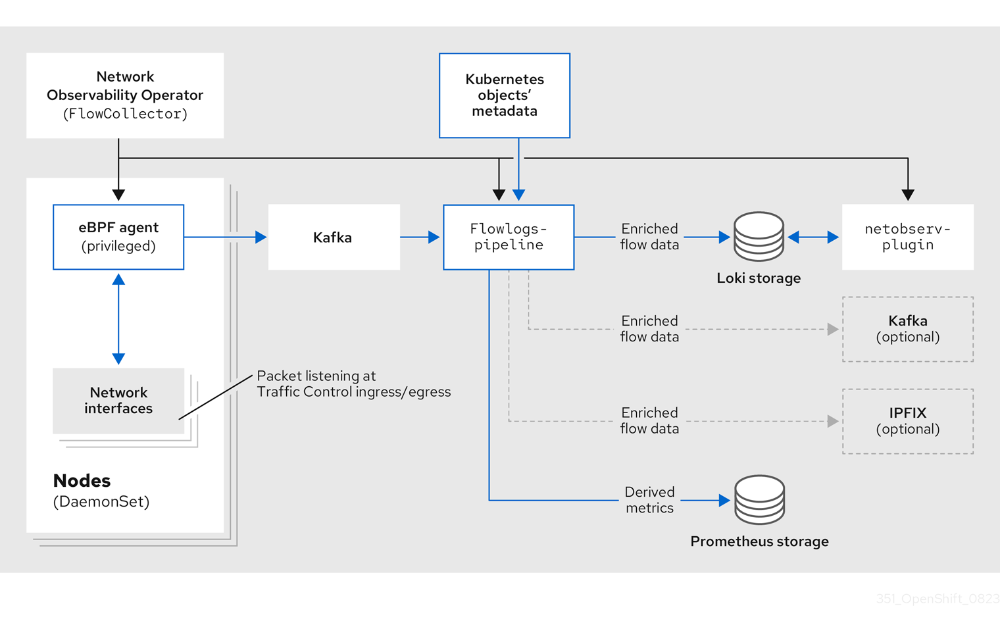

# NetObserv au RivieraDev 2024!

Ce repo contient les instructions et resources utiles au déroulement du [Deep Dive NetObserv](https://www.rivieradev.fr/session/226).

## Terminologie

- Flow (aka NetFlow aka Flow log): une clé consistant en source & dest IP+port et protocol L3/4 (5-tuples), et des meta-data (compteurs bytes/packets, TCP flags, compteurs drops, etc.)... puis enrichi avec infos K8S.
- eBPF: techno permettant d'injecter un programme dans certaines parties du noyau Linux (hook points), ici utilisé afin de monitorer le trafic.
- [OperatorHub](https://operatorhub.io/): un registre d'opérateurs Kubernetes, que l'on peut installer sur son cluster. Dans OpenShift 4, il est intégré à la console.
- [Loki](https://grafana.com/docs/loki/latest/): un log store développé par Grafana, concurrent d'Elastic. Peut s'adosser à du stockage objet/S3 (entre autres).
- [KIND](https://kind.sigs.k8s.io/): "Kubernetes in Docker": un mini k8s utilisable sur son laptop.
- [Prometheus](https://prometheus.io/docs/introduction/overview/): un metric store, sans doute le plus utilisé dans l'écosystème k8s.
- [CNI](https://kubernetes.io/docs/concepts/extend-kubernetes/compute-storage-net/network-plugins/): plugins network pour K8S. Vous en avez forcément un (au moins) sur votre cluster. Il n'est pas garanti que NetObserv fonctionne avec n'importe lequel. Par exemple, Cilium bloque l'exécution des agents eBPF de netobserv.

## Diagramme NetObserv

https://docs.openshift.com/container-platform/4.15/observability/network_observability/understanding-network-observability-operator.html

### Without Kafka



### With Kafka




## Installation

### OpenShift / OperatorHub

Vous pouvez utiliser la console OpenShift pour installer l'opérateur NetObserv (ou Network Observability) ainsi que Loki.

Pour commencer, le plus simple sera de faire sans Loki:

```bash
# Configurer NetObserv (resource FlowCollector)
kubectl apply -f https://raw.githubusercontent.com/jotak/netobserv-rivieradev/main/deploy/netobserv/flowcollector-no-loki.yaml
```

Si vous utilisez l'opérateur community, vous devrez activer le "User workload monitoring" d'OpenShift, de façon à activer Prometheus pour tous les workloads:

```bash
# Activer le "User workload monitoring" (c'est juste un flag dans une config map)
kubectl apply -f https://raw.githubusercontent.com/jotak/netobserv-rivieradev/main/deploy/openshift-user-workload-monitoring.yaml
```

#### Loki Operator

C'est la partie pas facile de l'installation. Commençons par un lien vers la doc: https://docs.openshift.com/container-platform/4.15/observability/network_observability/installing-operators.html#network-observability-loki-installation_network_observability

La doc mentionne principalement comment configurer Loki avec AWS / S3. Cependant d'autres options sont possibles: https://docs.openshift.com/container-platform/4.15/observability/logging/log_storage/installing-log-storage.html#logging-loki-storage_installing-log-storage.

Il est aussi possible d'utiliser Grafana Cloud.

Une fois la doc suivie & le Secret créé dans le namespace netobserv, reste à configurer un LokiStack et le FlowCollector:

```yaml
# Configurer LokiStack (à adapter éventuellement: référence du secret, size, storageClassName...)
kubectl apply -n netobserv -f https://raw.githubusercontent.com/jotak/netobserv-rivieradev/main/deploy/lokistack.yaml

# Configurer NetObserv (resource FlowCollector)
kubectl apply -f https://raw.githubusercontent.com/jotak/netobserv-rivieradev/main/deploy/netobserv/flowcollector-loki-operator.yaml
```

### KIND (quick setup)

Téléchargez KIND: https://kind.sigs.k8s.io/

```bash
# Cloner le repo
git clone git@github.com:netobserv/network-observability-operator.git
cd network-observability-operator

# Démarrer KIND (pour podman, il faut lancer en root, cf plus bas)
kind create cluster
kubectl config set-context --current --namespace=netobserv

# Déployer netobserv operator
USER=netobserv make deploy-kind

# Déployer Grafana et Loki
make deploy-grafana deploy-loki

# Configurer NetObserv (resource FlowCollector)
kubectl apply -f https://raw.githubusercontent.com/jotak/netobserv-rivieradev/main/deploy/netobserv/flowcollector-kind.yaml

# Déployer Prometheus
make deploy-prometheus
```

### KIND (détaillé)

Téléchargez KIND: https://kind.sigs.k8s.io/

```bash
# Démarrer KIND (pour podman, il faut lancer en root, cf plus bas)
kind create cluster
kubectl create namespace netobserv && kubectl config set-context --current --namespace=netobserv

# Installer cert-manager
kubectl apply -f https://github.com/cert-manager/cert-manager/releases/download/v1.9.1/cert-manager.yaml

# Installer Prometheus
kubectl apply -f https://raw.githubusercontent.com/jotak/netobserv-rivieradev/main/deploy/prometheus.yaml && kubectl rollout status "deploy/prometheus" --timeout=600s
kubectl port-forward --address 0.0.0.0 svc/prometheus 9090:9090 2>&1 >/dev/null &

# Installer Loki
kubectl apply -f https://raw.githubusercontent.com/jotak/netobserv-rivieradev/main/deploy/loki.yaml

# Installer Grafana
kubectl apply -f https://raw.githubusercontent.com/jotak/netobserv-rivieradev/main/deploy/grafana.yaml && kubectl rollout status "deploy/grafana" --timeout=600s
kubectl port-forward --address 0.0.0.0 svc/grafana 3000:3000 2>&1 >/dev/null &

# Installer NetObserv operator
kubectl apply -f https://raw.githubusercontent.com/jotak/netobserv-rivieradev/main/deploy/netobserv/operator.yaml --server-side

# Configurer NetObserv (resource FlowCollector)
kubectl apply -f https://raw.githubusercontent.com/jotak/netobserv-rivieradev/main/deploy/netobserv/flowcollector-kind.yaml
```

### KIND: suite

Console Prometheus: http://localhost:9090/
- On peut exécuter du promQL tel que: `sum(rate(netobserv_workload_ingress_bytes_total[1m])) by (SrcK8S_Namespace, DstK8S_Namespace)`.

Console Grafana: http://localhost:3000/
- Log avec admin/admin
- Cliquer sur "skip" pour passer la définition d'un autre mot de passe
- Voir les flow logs par exemple dans le menu "Explore"
- On pourra également importer la dashboard: [Network Observability.json](./deploy/dashboard/Network%20Observability.json)

Pour éditer la config de NetObserv:

```bash
kubectl edit flowcollector cluster
```

#### Créer le cluster KIND avec podman en root

!! Pas secure du tout !! Les pods fonctionnent en root.

```bash
sudo kind create cluster
sudo mv /root/.kube/config /home/user/.kube/config-root
sudo chown user:user /home/user/.kube/config-root
export KUBECONFIG=/home/$USER/.kube/config-root
```

### Autre

Si vous avez OperatorHub, utilisez-le pour installer l'opérateur.

Vous pouvez aussi utiliser [operator-sdk](https://sdk.operatorframework.io/docs/installation/) puis lancer:

```bash
operator-sdk run bundle quay.io/netobserv/network-observability-operator-bundle:v1.6.0 --timeout 5m
```

Autrement, clonez le repo operator et utilisez la Makefile:

```bash
git clone git@github.com:netobserv/network-observability-operator.git
cd network-observability-operator
USER=netobserv make deploy

# Si besoin, pour installer Grafana / Prometheus / Loki:
make deploy-grafana deploy-loki

# Configurer NetObserv (resource FlowCollector)
kubectl apply -f https://raw.githubusercontent.com/jotak/netobserv-rivieradev/main/flowcollector-kind.yaml

make deploy-prometheus
```

## Déployer des workloads

E.g. demo-mesh-arena:

```bash
kubectl create namespace mesh-arena ; kubectl apply -f https://raw.githubusercontent.com/jotak/demo-mesh-arena/main/quickstart-naked.yml -n mesh-arena
kubectl port-forward --address 0.0.0.0 svc/ui -n mesh-arena 8080:8080 2>&1 >/dev/null &
```

DDoS e.g. [hey-ho](https://github.com/jotak/hey-ho):

```bash
./hey-ho.sh -t http://ball.mesh-arena.svc:8080/health -z 5m -r 10 -g hacker -b
```

(Détailler les scénarios)

## Activer des features

Activer les packet drops, latency, DNS, AZ ...

## Usages avancés

- Customiser les métriques, créer des alertes
- Filtrage eBPF, subnet flagging
- CLI, packet capture

## Sujets annexes que l'on peut aborder

- eBPF, c'est quoi?
- Prometheus et promQL: comment utiliser?

## Liens

- Doc OpenShift: https://docs.openshift.com/container-platform/latest/network_observability/installing-operators.html
- GitHub principal: https://github.com/netobserv/network-observability-operator
- OperatorHub: https://operatorhub.io/operator/netobserv-operator
- Compte masto: https://hachyderm.io/@netobserv

### Docs spécifiques

- Métriques: https://github.com/netobserv/network-observability-operator/blob/main/docs/Metrics.md
- Flows format: https://github.com/netobserv/network-observability-operator/blob/main/docs/flows-format.adoc
