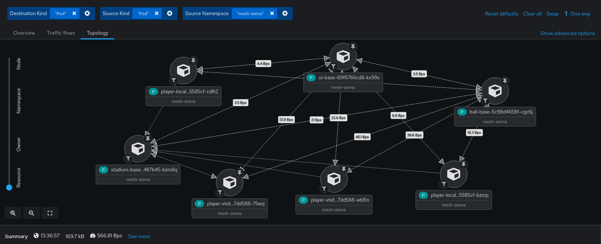
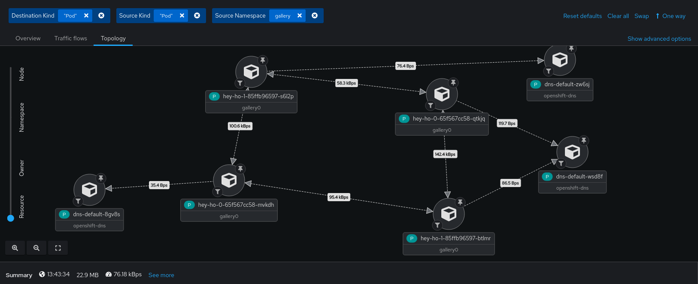
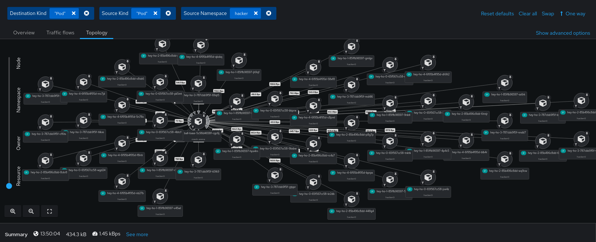

# NetObserv au RivieraDev 2024!

Ce repo contient les instructions et resources utiles au déroulement du [Deep Dive NetObserv](https://www.rivieradev.fr/session/226).

Slides : https://docs.google.com/presentation/d/1NVoBxhpfHhYUfwq_n9RDE9TajCmKBPBz4rhZ5N-mY8k/

Rejoignez le chat discord: https://discord.gg/tJDGfjMf


## Terminologie

- [KIND](https://kind.sigs.k8s.io/): "Kubernetes in Docker": un mini k8s utilisable sur son laptop.
- [OperatorHub](https://operatorhub.io/): un registre d'opérateurs Kubernetes, que l'on peut installer sur son cluster. Dans OpenShift 4, il est intégré à la console.
- [CNI](https://kubernetes.io/docs/concepts/extend-kubernetes/compute-storage-net/network-plugins/): plugins network pour K8S. Vous en avez forcément un (au moins) sur votre cluster. Il n'est pas garanti que NetObserv fonctionne avec n'importe lequel. Par exemple, Cilium bloque l'exécution des agents eBPF de netobserv.
- [Loki](https://grafana.com/docs/loki/latest/): un log store développé par Grafana, concurrent d'Elastic. Peut s'adosser à du stockage objet/S3 (entre autres).
- [Prometheus](https://prometheus.io/docs/introduction/overview/): un metric store, sans doute le plus utilisé dans l'écosystème k8s. Ne permet pas de stocker des logs.
- Flow (aka [NetFlow](https://fr.wikipedia.org/wiki/NetFlow) aka Flow log): une clé consistant en source & dest IP+port et protocol L3/4 (5-tuples), et des meta-data (compteurs bytes/packets, TCP flags, compteurs drops, etc.)... puis enrichi avec infos K8S.
- [eBPF](https://ebpf.io/fr-fr/): techno permettant d'injecter un programme dans certaines parties du noyau Linux (hook points), ici utilisé afin de monitorer le trafic via le Traffic Controller (TC/TCx hooks).

## Diagramme NetObserv

https://docs.openshift.com/container-platform/4.15/observability/network_observability/understanding-network-observability-operator.html

### Sans Kafka


### Avec Kafka


## Installation

### OpenShift / OperatorHub

Vous pouvez utiliser la console OpenShift pour installer l'opérateur NetObserv (ou Network Observability) ainsi que Loki.

Pour commencer, le plus simple sera de faire sans Loki:

```bash
# Configurer NetObserv (resource FlowCollector)
kubectl apply -f https://raw.githubusercontent.com/jotak/netobserv-rivieradev/main/deploy/netobserv/flowcollector-no-loki.yaml
```

Si vous utilisez l'opérateur community, vous devrez activer le "User workload monitoring" d'OpenShift, de façon à activer Prometheus pour tous les workloads:

```bash
# Activer le "User workload monitoring" (c'est juste un flag dans une config map)
kubectl apply -f https://raw.githubusercontent.com/jotak/netobserv-rivieradev/main/deploy/openshift-user-workload-monitoring.yaml
```

#### Loki Operator

C'est la partie pas facile de l'installation. Commençons par un lien vers la doc: https://docs.openshift.com/container-platform/4.15/observability/network_observability/installing-operators.html#network-observability-loki-installation_network_observability

La doc mentionne principalement comment configurer Loki avec AWS / S3. Cependant d'autres options sont possibles: https://docs.openshift.com/container-platform/4.15/observability/logging/log_storage/installing-log-storage.html#logging-loki-storage_installing-log-storage.

Il est aussi possible d'utiliser Grafana Cloud.

Une fois la doc suivie & le Secret créé dans le namespace netobserv, reste à configurer un LokiStack et le FlowCollector:

```yaml
# Configurer LokiStack (à adapter éventuellement: référence du secret, size, storageClassName...)
kubectl apply -n netobserv -f https://raw.githubusercontent.com/jotak/netobserv-rivieradev/main/deploy/lokistack.yaml

# Configurer NetObserv (resource FlowCollector)
kubectl apply -f https://raw.githubusercontent.com/jotak/netobserv-rivieradev/main/deploy/netobserv/flowcollector-loki-operator.yaml
```

#### Alternative plus simple: Loki en 1 pod monolithe

Si on ne veut pas perdre de temps avec l'opérateur Loki et son stockage, il y a une alternative simple qui est suffisante pour ce workshop:
déployer un pod unique de Loki en mode "monolithe".

```bash
kubectl create namespace netobserv
kubectl apply -f <(curl -L https://raw.githubusercontent.com/netobserv/documents/5410e65b8e05aaabd1244a9524cfedd8ac8c56b5/examples/zero-click-loki/1-storage.yaml) -n netobserv
kubectl apply -f <(curl -L https://raw.githubusercontent.com/netobserv/documents/5410e65b8e05aaabd1244a9524cfedd8ac8c56b5/examples/zero-click-loki/2-loki.yaml) -n netobserv
```
(ces quelques lignes sont données aussi dans la description de l'opérateur netobserv)

Ensuite, pour activer Loki dans netobserv, il suffit de switcher `spec.loki.enable` à `true`:

```bash
kubectl patch flowcollector cluster --type json --patch='[ { "op": "replace", "path": "/spec/loki/enable", "value": true } ]'
```

### KIND (détaillé)

Téléchargez KIND: https://kind.sigs.k8s.io/

```bash
# Démarrer KIND (pour podman, il faut lancer en root, cf plus bas)
kind create cluster
kubectl create namespace netobserv && kubectl config set-context --current --namespace=netobserv

# Installer cert-manager
kubectl apply -f https://github.com/cert-manager/cert-manager/releases/download/v1.9.1/cert-manager.yaml

# Installer Prometheus
kubectl apply -f https://raw.githubusercontent.com/jotak/netobserv-rivieradev/main/deploy/prometheus.yaml && kubectl rollout status "deploy/prometheus" --timeout=600s
kubectl port-forward --address 0.0.0.0 svc/prometheus 9090:9090 2>&1 >/dev/null &

# Installer Loki
kubectl apply -f https://raw.githubusercontent.com/jotak/netobserv-rivieradev/main/deploy/loki.yaml

# Installer Grafana
kubectl apply -f https://raw.githubusercontent.com/jotak/netobserv-rivieradev/main/deploy/grafana.yaml && kubectl rollout status "deploy/grafana" --timeout=600s
kubectl port-forward --address 0.0.0.0 svc/grafana 3000:3000 2>&1 >/dev/null &

# Installer NetObserv operator
kubectl apply -f https://raw.githubusercontent.com/jotak/netobserv-rivieradev/main/deploy/netobserv/operator.yaml --server-side

# Configurer NetObserv (resource FlowCollector)
kubectl apply -f https://raw.githubusercontent.com/jotak/netobserv-rivieradev/main/deploy/netobserv/flowcollector-kind.yaml
```

### KIND: vérification, ça fonctionne?

Console Prometheus: http://localhost:9090/
- On peut exécuter du promQL tel que: `sum(rate(netobserv_workload_ingress_bytes_total[1m])) by (SrcK8S_Namespace, DstK8S_Namespace)`.
- URL directe: http://localhost:9090/graph?g0.expr=sum(rate(netobserv_workload_ingress_bytes_total%5B1m%5D))%20by%20(SrcK8S_OwnerName%2C%20SrcK8S_Namespace%2C%20DstK8S_OwnerName%2C%20DstK8S_Namespace)&g0.tab=0&g0.display_mode=lines&g0.show_exemplars=0&g0.range_input=15m

Console Grafana: http://localhost:3000/
- Log avec admin/admin
- Cliquer sur "skip" pour passer la définition d'un autre mot de passe
- Voir les flow logs par exemple dans le menu "Explore"
- On pourra également importer la dashboard: [Network Observability.json](./deploy/dashboard/Network%20Observability.json)

Pour éditer la config de NetObserv:

```bash
kubectl edit flowcollector cluster
```

#### Créer le cluster KIND avec podman en root

!! Pas secure du tout !! Les pods fonctionnent en root.

```bash
sudo kind create cluster
sudo mv /root/.kube/config /home/user/.kube/config-root
sudo chown user:user /home/user/.kube/config-root
export KUBECONFIG=/home/$USER/.kube/config-root
```

### Autre

Si vous avez OperatorHub, utilisez-le pour installer l'opérateur.

Vous pouvez aussi utiliser [operator-sdk](https://sdk.operatorframework.io/docs/installation/) puis lancer:

```bash
operator-sdk run bundle quay.io/netobserv/network-observability-operator-bundle:v1.6.1-community --timeout 5m
```

Autrement, clonez le repo operator et utilisez la Makefile:

```bash
git clone git@github.com:netobserv/network-observability-operator.git
cd network-observability-operator
USER=netobserv make deploy

# Si besoin, pour installer Grafana / Prometheus / Loki:
make deploy-grafana deploy-loki

# Configurer NetObserv (resource FlowCollector)
kubectl apply -f https://raw.githubusercontent.com/jotak/netobserv-rivieradev/main/deploy/netobserv/flowcollector-kind.yaml

make deploy-prometheus
```

### Console NetObserv sans OpenShift

NB: il s'agit d'une version "standalone" du plugin console openshift, utilisée par l'équipe de développement dans le cadre de tests. Elle peut manquer de polishing ici ou là.

```bash
kubectl edit flowcollector cluster
```

Ajoutez ce yaml dans `consolePlugin`:

```yaml
    advanced:
      env:
        TEST_CONSOLE: "true"
```

```bash
kubectl set env deployment/netobserv-controller-manager -c "manager" RELATED_IMAGE_CONSOLE_PLUGIN="quay.io/jotak/network-observability-standalone-frontend:riviera2024"

kubectl get pods -w # attendre que le pod netobserv-plugin redémarre

kubectl port-forward --address 0.0.0.0 svc/netobserv-plugin 9001:9001 2>&1 >/dev/null &
```

Ouvrir http://localhost:9001/

## Déployer des workloads

### Mesh-arena

C'est une petite démo avec des bonshommes qui courent derrière un ballon

```bash
kubectl create namespace mesh-arena ; kubectl apply -f https://raw.githubusercontent.com/jotak/demo-mesh-arena/main/quickstart-naked.yml -n mesh-arena
# ou, pour KIND:
kubectl create namespace mesh-arena ; kubectl apply -f https://raw.githubusercontent.com/jotak/demo-mesh-arena/main/quickstart-9000.yml -n mesh-arena

kubectl port-forward --address 0.0.0.0 svc/ui -n mesh-arena 8080:8080 2>&1 >/dev/null &
```

Ouvrir ensuite http://localhost:8080

Dans NetObserv, vous verrez ça:



### Hey-ho

`Hey` est un programme d'injection de charge réseau, développé par @rakyll: https://github.com/rakyll/hey

[hey-ho](https://github.com/jotak/hey-ho) est une petite surcouche pour lancer ça via différents pods, accompagnés d'un serveur nginx, les uns sur les autres. Ou, alternativement, vers une cible spécifiée.

Attention, allez-y mollo avec ce script, il peut mettre un cluster sur les rotules.

Par exemple, une petite injection de charge de 200 workers au total, répartis en 2 déploiements, chacun rate-limited à 200 queries per second, pendant 30 secondes:

```bash
./hey-ho.sh -p -d 2
# ou:
./hey-ho.sh -p -d 2 -u 9000
```

NOTE: vous devrez peut-être ajouter `-u 9000` (par exemple) aux commandes hey-ho si vous rencontrez des erreurs. Pour "run as user 9000".




Ou en ciblant un service de "mesh-arena" deployé précédemment (simulant une attaque DDoS):

```bash
./hey-ho.sh -t http://ball.mesh-arena.svc:8080/health -z 2m -r 10 -g hacker -b
# ou:
./hey-ho.sh -t http://ball.mesh-arena.svc:8080/health -z 2m -r 10 -g hacker -u 9000 -b
```




## Activer des features

Activer les packet drops, latency, DNS, AZ ...

Tout est dans le CRD: https://docs.openshift.com/container-platform/4.16/observability/network_observability/flowcollector-api.html

## Usages avancés

- Customiser les métriques, créer des alertes
- Filtrage eBPF, subnet flagging
- CLI, packet capture

### Zoom sur les métriques et alertes, avec un cas pratique

Mettons que l'on souhaite être alerté en cas d'une hausse de trafic anormale. On prend le cas de l'ingress ici, mais ça marche aussi en egress! (Vos workloads sont utilisés à mauvais escient).

La métrique existe: `netobserv_workload_ingress_bytes_total`.
On va créer une alerte:

```bash
kubectl apply -f https://raw.githubusercontent.com/jotak/netobserv-rivieradev/main/deploy/metrics-alerts/throughput-alert.yaml

# on attend un peu... puis on rejoue le "DDoS" précédent
./hey-ho.sh -t http://ball.mesh-arena.svc:8080/health -z 2m -r 10 -g hacker -b
```

=> L'alerte se déclenche

Et si l'attaquant ne génère pas de grosse volumétrie? E.g. SYN flood

On peut se focaliser alors sur le nombre de flows générés, plutôt que le traffic. Un flow = un 5-tuples [Src IP, Src Port, Dst IP, Dst Port, Protocol]. Donc chaque connection TCP génère un flow différent.

Pour créer notre métrique qui va compter le nombre de flows plutôt que le nombre de bytes ou packets, utilisons l'[API FlowMetrics](https://docs.openshift.com/container-platform/4.16/observability/network_observability/flowmetric-api.html):

```yaml
apiVersion: flows.netobserv.io/v1alpha1
kind: FlowMetric
metadata:
  name: ingress-cardinality
  namespace: netobserv
spec:
  metricName: ingress_cardinality
  type: Counter
  direction: Ingress
  labels: [SrcSubnetLabel,DstK8S_Namespace,DstK8S_OwnerName,DstK8S_OwnerType]
```

(D'autres examples [ici](https://github.com/netobserv/network-observability-operator/tree/main/config/samples/flowmetrics)).

```bash
kubectl apply -f https://raw.githubusercontent.com/jotak/netobserv-rivieradev/main/deploy/metrics-alerts/ingress-cardinality.yaml
kubectl apply -f https://raw.githubusercontent.com/jotak/netobserv-rivieradev/main/deploy/metrics-alerts/throughput-cardinality-alert.yaml
```

Simulons ensuite notre attaque avec un rate-limit de 1 query par seconde depuis 2500 sources:

```bash
./hey-ho.sh -t http://ball.mesh-arena.svc:8080/health -z 1m -r 10 -g hacker -q 1 -b
```

=> Cette fois-ci, la première alerte ne se déclenche pas (volumétrie trop faible); en revanche la 2e alerte se déclenche.

## Sujets annexes que l'on peut aborder

- eBPF, c'est quoi?
- Prometheus et promQL: comment utiliser?

## Liens

- Doc OpenShift: https://docs.openshift.com/container-platform/latest/network_observability/installing-operators.html
- GitHub principal: https://github.com/netobserv/network-observability-operator
- OperatorHub: https://operatorhub.io/operator/netobserv-operator
- Compte masto: https://hachyderm.io/@netobserv

### Docs spécifiques

- Métriques: https://github.com/netobserv/network-observability-operator/blob/main/docs/Metrics.md
- Flows format: https://github.com/netobserv/network-observability-operator/blob/main/docs/flows-format.adoc
